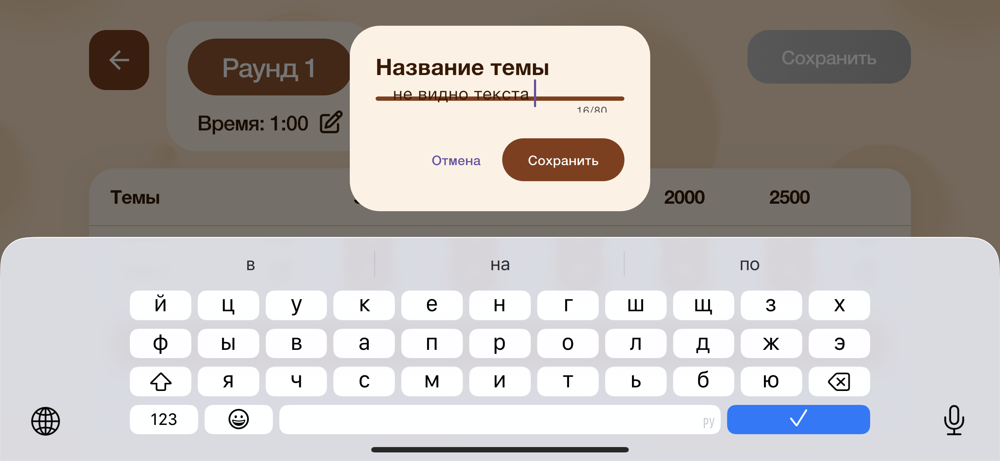
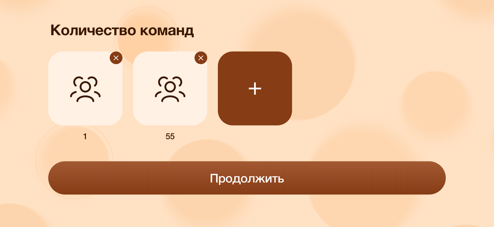
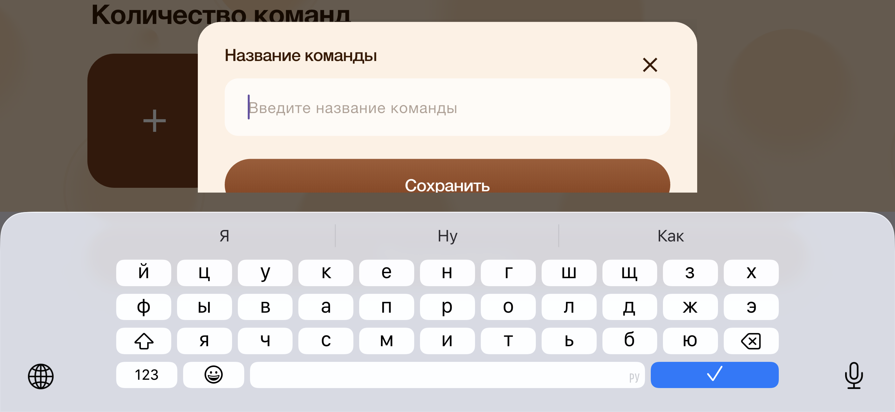
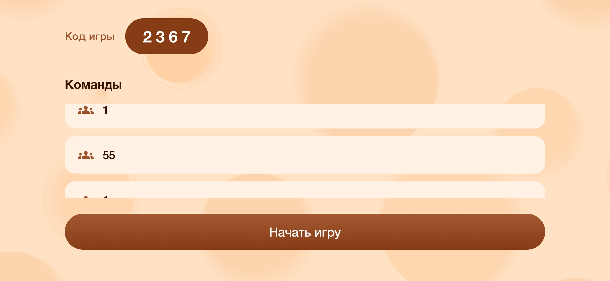
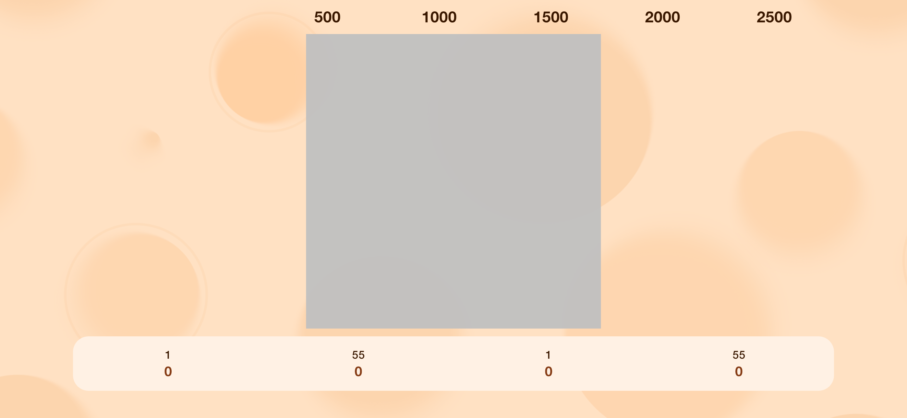
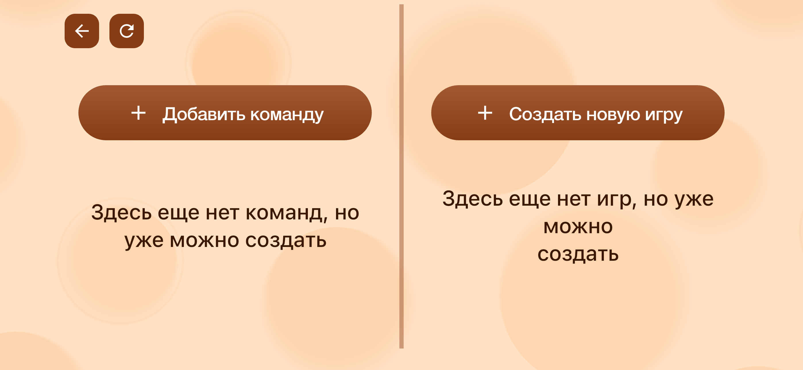

Вот тут бы чуть расширить, чтоб не съедало текст

Здесь мы должны выбирать команды из ранее созданных

Создал 2 команды - а они задублировались и получилось 4

Как и прежде нигде нет возможности вернуться на предыдущий экран

После начала игры ничего не отображается

Не закрыть ни вернуться назад

После нового входа всё слетело и ничего не сохранилось

вот тут на этом экране надо убрать блок "добавить команду здесь еще нет команд" надо убрать этот блок и оставить только "Создать новую игру"

Еще раз повторяю как должно быть!!! 

Заходим в ведущего. Жмем кнопку «создать новую игру» 

-> вводим название 

-> жмем сохранить

-> попадаем на экран настройки игры (раунды, темы, вопросы)!!! 

-> сохраняем. 

-> после сохранения попадаем на экран «создать команду» / «создать игру»

Чтобы играть

-> жмем на нужное игре «начать» 

-> выбираем команды которые будут играть

-> жмем далее

-> и далее по сценарию, который вы описывали.

malenkisvetok
20:31
NikitaAg-ool
Не закрыть ни вернуться назад
Вы там тапните на динамический остров

Сверху слева

NikitaAg-ool
20:32
Увидел возвращение

malenkisvetok
20:34

NikitaAg-ool
После начала игры ничего не отображается

Нет все работает

NikitaAg-ool
20:34
Но на экране выбора команд к игре, уже нет возвращения и закрытия

Вот что у меня на этом экране

malenkisvetok
IMG_4197.PNG
Вернуться и закрыть или подвести итог. Так же отстутсвуют

malenkisvetok
20:36
NikitaAg-ool
Вернуться и закрыть или подвести итог. Так же отстутсвуют
Ну там итог подводится после закрытия всех вопросов

Никита вы же хотели веб версию запустить верно?

Запускаете или отменили ?

У меня есть спец предложение Никита вам точно понравится

NikitaAg-ool
20:46
К веб приложению вернемся только после того как настроим здесь всю логику

malenkisvetok
20:47
NikitaAg-ool
К веб приложению вернемся только после того как настроим здесь всю логику
Короче смотрите предлагаю начать чтоб тестирование шло быстрее потому что сам тоже на тестфлай гружу и долго получается

NikitaAg-ool
20:47
malenkisvetok
Ну там итог подводится после закрытия всех вопросов
Должна быть кнопка принудительного подведения итогов. Именно для этого есть данная кнопка. 

Игра может завершаться в любой момент!!!!

malenkisvetok
20:47
NikitaAg-ool
Должна быть кнопка принудительного подведения итогов. Именно для этого есть данная кнопка. 

Игра может завершаться в любой момент!!!!
Понял

Когда у вас есть время ? Чтоб в режиме реального времени дорабатывать и чтоб вы смотрели правки

NikitaAg-ool
20:48
malenkisvetok
Короче смотрите предлагаю начать чтоб тестирование шло быстрее потому что сам тоже на тестфлай гружу и долго получается
Тут согласен. Долго.

Вы по какому часовому поясу живете? Мск?

malenkisvetok
20:49
NikitaAg-ool
Вы по какому часовому поясу живете? Мск?
GMT +5

NikitaAg-ool
20:49
Чтобы сориентироваться и договориться.

malenkisvetok
20:49
NikitaAg-ool
Вы по какому часовому поясу живете? Мск?
На два часа позднее вас

NikitaAg-ool
20:50
У меня сейчас 22:50

Я в Красноярске

Мне удобно завтра в 16:00 по моему времени. Удобно ли Вам?

Другой вариант после 21:00 по красноярскому.

То есть с 21:00 до 23:00

У Вас сейчас 20:50 правильно?

malenkisvetok
21:06
NikitaAg-ool
У Вас сейчас 20:50 правильно?
верно[

сейчас не получится да?

NikitaAg-ool
04:29
Сегодня в 16:00 удобно?

malenkisvetok
08:31
NikitaAg-ool
Сегодня в 16:00 удобно?
По какому времени мск?

